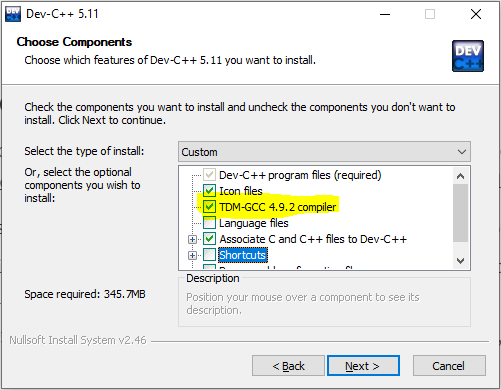
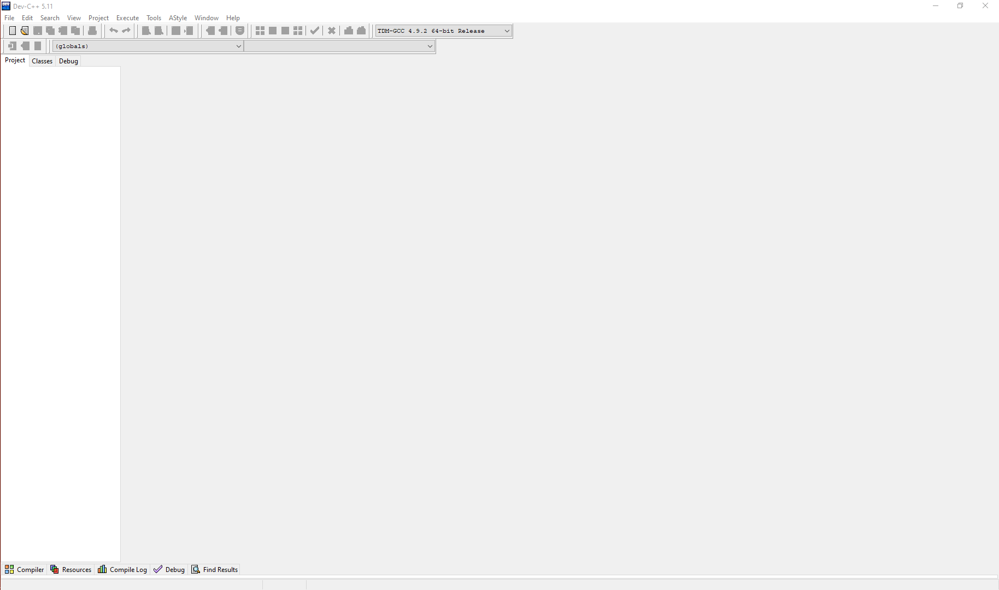
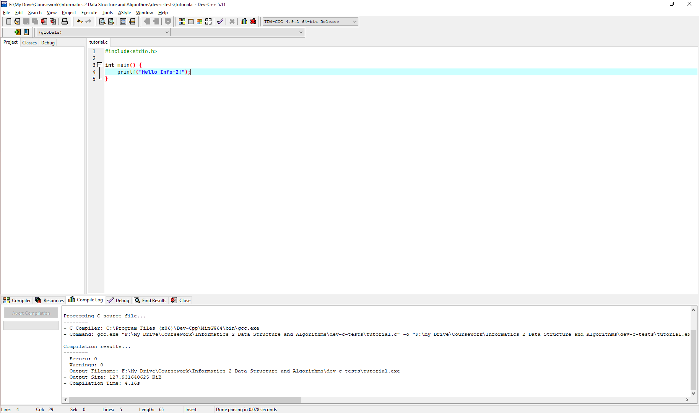
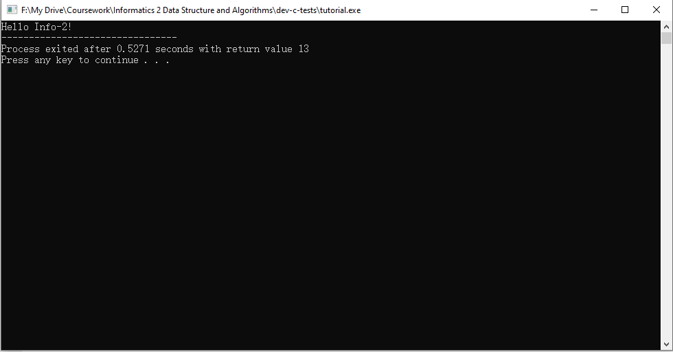

# Installation of C Compiler


Just like in the Info-1 course, you will need a compiler to finish the exercises (and exams) for Info-2, but we need a compiler for ```C``` this time. In this tutorial, we will provide some instructions on how to set up your compiler, and how to use its basic functions.

## Windows Users

### Installation

If you are using Windows, we recommend you to use **Dev-C/C++**, which can be downloaded at [https://sourceforge.net/projects/orwelldevcpp/](https://sourceforge.net/projects/orwelldevcpp/). The installation are listed as below:

* Download the installer. It should be some .exe file with the filename ```Dev-cpp 5.11 TDM-GCC 4.92 setup.exe```.

* Double click the installer, select your preferred language (we recommend you to use **English**, as in future we will demonstrate the process in English version).

* Choose components. Make sure you have tick the ```TDM-GCC 4.92 compiler```, as illustrated below:

  

* Click Next and finish the installation process, as prompted.

* Launch the Dev-C++ from your desktop icon or the menu, and you should be able to see the following window:



* Click the ```File->New->Source File``` button to create a new ```.c``` file, and you can start programming!
* When you write some code, you can save the source file to some folder on your local computer.

### Run Your Program

Now that you've write some code in the new file you created, you can compile and run your program in the Dev-C++ environment. Now assume we have the code below:



You can then press ```F11```, or click the ```Execute->Compile & Run ``` button to compile and run your code. After you do it, you will see a window as below:



If you see the same thing with me, then you are good to go.